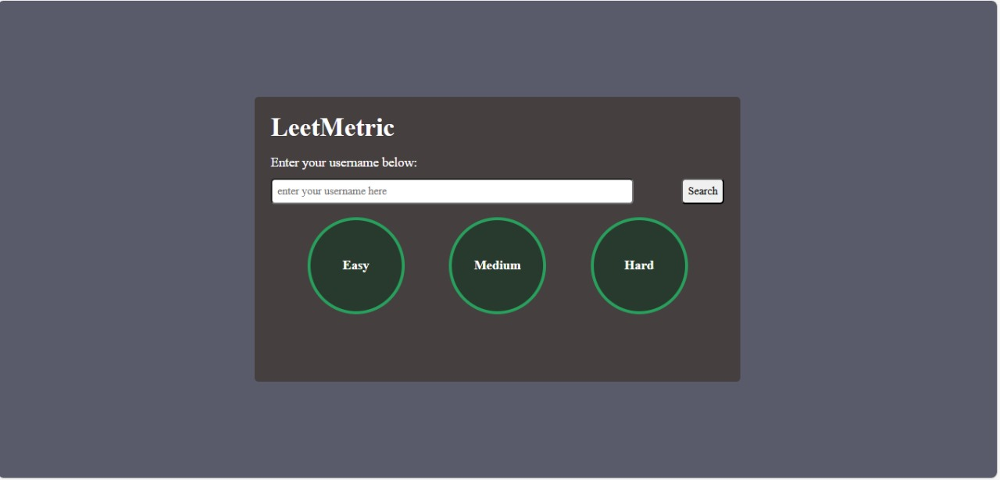

# 📊 LeetMetric – LeetCode Stats Tracker Web App

LeetMetric is a sleek, responsive JavaScript web app that lets you track your LeetCode problem-solving progress. Just enter your LeetCode username and instantly see how many problems you’ve solved, submission stats, and completion percentages for Easy, Medium, and Hard levels.

---

## 🚀 Features

- 🔍 Search any LeetCode username
- 📈 Visual circular progress bars
- 📊 Stat cards showing submissions by difficulty
- ⚡ Real-time data from LeetCode's GraphQL API
- 🎨 Clean and responsive UI
- ✅ Input validation and error handling

---

## 🖼️ Preview

 <!-- You can take a screenshot and save it as "screenshot.png" -->

---

## 🛠️ Built With

- HTML5  
- CSS3 (Flexbox, conic-gradient)  
- Vanilla JavaScript  
- LeetCode GraphQL API  
- Proxy: `https://cors-anywhere.herokuapp.com/`

---

## 📦 How to Use

1. Clone this repository:
   ```bash
   git clone https://github.com/new-ananya/leetmetric.git
   cd leetmetric
